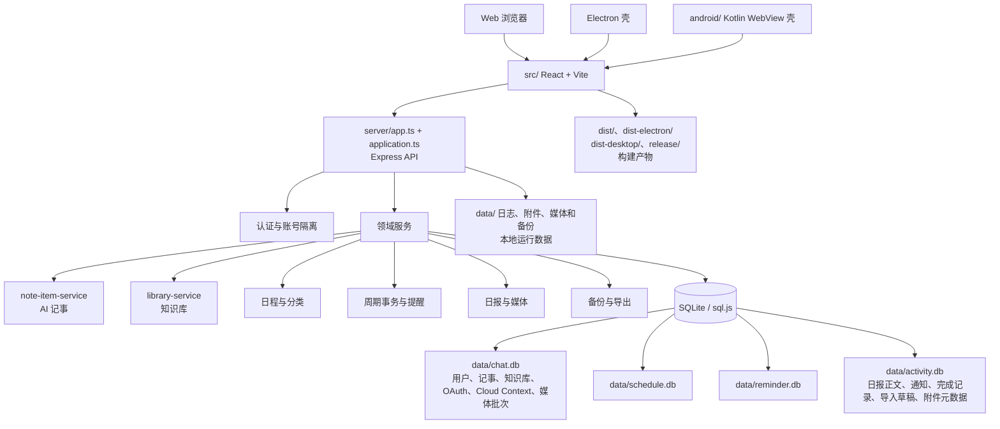
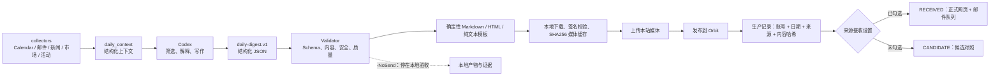

# Orbit 跨项目地图

- Status: LIVING
- Scope: 本文列明的源码结构、合同或验证方法；历史证据按时点使用。
- Source review: 2026-10-07 核对 Android 在线壳、Push 队列与知识库个人资料入口；版本以 package.json 为准，状态以 docs/TASKS.md 为准。
- Authority: 当前源码与自动化验证优先；文档职责见文档索引。
- Update trigger: 本领域 API、数据归属、媒体策略或验收入口变化。
- Supersedes: 原文中已纠正的漂移描述；保留历史快照时间边界。
- Do not use for: 推断当前生产部署、Work 配置或邮件收件箱状态。

本文档是 Orbit 主仓库与个人情报日报 V2 的逻辑地图。它只记录可提交的模块、边界和验证入口，不记录绝对个人路径、用户数据、令牌、授权码或运行机器上的真实配置。

## 1. 项目与边界

| 逻辑项目名 | 仓库范围 | 当前定位 | 允许的关系 |
| --- | --- | --- | --- |
| Orbit | `smart-schedule-agent/` | 主应用：Web、Electron、Express API、日程、提醒、账户和日报服务端 | 接收 V2 的已校验日报发布与媒体上传；按账号隔离保存 |
| 个人情报日报 V2 | `日报-v2/` | 当前日报采集、结构化生成、校验、媒体本地化和发布程序 | 通过只读/发布专用接口与 Orbit 交互；默认本地 `-NoSend` 验收 |
| `LEGACY_PROJECT` | `旧版日报/` | 只读参考与可恢复回滚边界 | 不修改代码、Prompt、配置、产物、邮件投递或定时任务 |

### 1.1 主仓库结构



主应用的四个数据库文件属于运行态数据，不能从生产机器回填到仓库。`dist/`、`dist-electron/`、`dist-desktop/` 和 `release/` 是构建/打包产物；源码、测试和文档属于提交边界。

Orbit 基础升级的 Provider/能力入口是 `ai-provider-{contract,workbuddy,chatgpt}.ts`、`ai-model-capabilities.ts` 和 `routes/ai-providers.ts`；Orbit 工具由 `orbit-tools.ts` 复用现有领域服务。OAuth 助手在 `scripts/chatgpt-connect.ts`，凭据只在被忽略的加密目录。附件由 `orbit-attachments.ts` 关联会话/消息，`file-parser.ts` / `file-parser-worker.mjs` 共享有界解析，Office ZIP 预检在 `archive-validation.mjs`。前端消息、附件、设置搜索和 CSS Motion 沿用原组件。具体接口与边界只维护在 [架构](docs/ARCHITECTURE.md)。

交互连接与个人报告复用原有服务：`notification-chat.ts` 将通知队列持久投递至主对话；`activity-events.ts` / `activity-statistics.ts` 汇总可核实的执行事件；`activity-reports.ts` 保存报告、生成只读洞察和独立周报。`orbit-profile.ts` 复用账号附件保存头像，`connected-backup.ts` 纳入账号恢复。前后端共享 `src/utils/orbit-links.ts` 与 `settings-registry.ts`；网页入口仍为原统计路由。个人周报独立于情报日报，接口、未知历史与恢复边界维护在 [连接与个人报告合同](docs/ARCHITECTURE.md#交互连接与个人活动报告合同)。

CalDAV 入口为 `server/routes/caldav.ts`；`caldav-service` 共享手动/后台服务，`caldav-control` 管理自动化与备份恢复互斥，投影和账本位于 `caldav-projection`/`caldav-bridge`；周期读取全部已存实例，完成策略显式配置，派生副本按周期 ID 归并。既有任务框架增加默认未启用的5分钟桥接调度；独立服务与合成测试在 `infra/caldav-poc/`，外部进程不读主应用数据库。边界见 [CalDAV 合同](docs/CALDAV-BRIDGE.md)。

### 1.2 日报 V2 Local 流程

Cloud 新新闻信息图准备入口为 `daily_report.prepare_visuals_v2`，绘图实现位于 `server/digest-v2-visuals.ts`，绑定与持久媒体复用原 run manifest 和媒体目录；不是 Local 照片审核或 V3。字段、安全与验收边界见 [原创信息图合同](docs/CHATGPT-WORK-CLOUD.md#每日新新闻的原创信息图准备)。

新版 V2.5 的独立 Cloud 分支由 `server/digest-v2-{contract,service,media,fetch,render}.ts` 实现，MCP 入口仍在 `daily-report-cloud-mcp.ts`。输入运行与隔离产物在原 `activity.db` 的 `digest_v2_runs`、`digest_v2_artifacts`；production 才写原日报/通知表。阅读复用 `reports-read.ts` 与 `DailyReportsPage.tsx`，媒体字节镜像进入原媒体/备份边界；正式服务可显式让 Shadow 与 production 均使用持久本地媒体，独立隔离服务沿用测试 R2。V1 Local 图示仍适用于原链路，不能作为新版合同。详细字段、开关和 Shadow 边界见 [V2.5 合同](docs/CHATGPT-WORK-CLOUD.md#daily-digest-v25隔离新版合同)。

`server/digest-v2-sources.ts` 提供默认关闭、按账号启用的 AIHot REST 适配与 Gmail 结构化短摘录标准化；`daily_report.prepare_sources_v2` 将候选冻结到原 run 的七天快照。Gmail 由网页版 Work 既有连接读取，服务端不取得 Gmail 凭据；最多三条拓展阅读复用 V2 合同与确定性渲染。来源状态、回退、媒体和真实 Shadow 边界见 [三来源合同](docs/CHATGPT-WORK-CLOUD.md#三来源候选与拓展阅读)。

V3 Core 位于同一个 `activity.db`：`server/digest-v3-store.ts` 管理 Event/Revision/Evidence/Analysis、引用表与 D09 本地冻结行，`activity-store.ts` 负责初始化和可靠写回。原 `backup-service.ts` 账号备份当前包含八组 V3 行，兼容旧七组备份并保护已有冻结记录；同账号替换和跨账号 ID 重映射均有本地验证。D07 的 `digest-v3-local-flow.ts` 对人工审核来源做原子写入和精确预览，`routes/digest-v3.ts` 提供登录态的受控提交、按账号/截点分页历史，以及 D09 具体日报版本的引用冻结/读取。D08 的 `digest-v3-offline-match.ts` 只在隔离回放里给双轴建议，`digest-v3-offline-extract.ts` 只对有界短摘录作限定规则抽取并保留事实支持文本；两者均不写活动库。详见 [V3 Core 合同](docs/DAILY-DIGEST-V3-CORE-CONTRACT.md#d09-第一步人工核验引用冻结2026-09-28)与[阶段事实安全评测](docs/archive/digest/DAILY-DIGEST-D08-FACT-STATUS-SAFETY-20260927.md)。没有人工纠正/恢复、Work/MCP 写入、正式日报发布或真实 Shadow 自动匹配。

D13 本地 Research/Thesis 位于同一活动库：`server/digest-research-store.ts` 管理研究历史、提案与确认版本，登录态 API 位于 `server/routes/research.ts`，网页 `/research` 从头像菜单进入。账号级备份/恢复包含三张新表；Workspace Agent 触发仅有合成协议探针，真实 Work 与结果回传尚未接通。完整边界见 [研究与观点合同](docs/DAILY-DIGEST-RESEARCH-THESIS.md)。

图文记事由 `note-item-service.ts`、`note-image-service.ts` 与 `routes/notes.ts` 维护，复用账号附件存储，独立于聊天关联。移动筛选共用 `CompactFilterSheet`，图文编辑/查看共用 `NoteImages`，草稿及Clipboard分别在 `composer-draft.ts` 和 `note-clipboard.ts`。生命周期/备份合同见 [架构](docs/ARCHITECTURE.md#记事图片与草稿合同)，使用方式见 [用户指南](docs/USER-GUIDE.md)。



模型只产生结构化内容；Markdown、HTML、纯文本、图片路径、生产日报记录、邮件队列和归档由确定性程序负责。媒体校验或上传失败时，不执行最后的日报发布。旧六章日报仍走受限 Markdown 兼容路径。

上述媒体失败阻断规则属于 Local 链路。Cloud 由服务端受控获取媒体：无 `mediaBatchId` 时逐图 Best Effort，有批次时保持 READY、归属和完整性检查。正文完整性均为硬闸门。Cloud `dry_run=true` 不保存日报、不入邮件队列，但兼容媒体处理可能写入托管文件。当前合同与历史运行记录见 [Cloud 文档](docs/CHATGPT-WORK-CLOUD.md)，文档导航见 [索引](docs/README.md)。

## 2. 跨项目 API 与安全边界

| 接口/页面 | 调用方 | 作用 | 边界 |
| --- | --- | --- | --- |
| `/api/integrations/daily-report/agenda` | V2 collector | 按显式日期读取当前账号日程 | Bearer 只读令牌、按账号隔离，不允许写入 |
| `/api/integrations/daily-report/mail` | V2 mail collector | 读取当前账号 QQ 未读邮件摘要 | 只返回摘要，不返回授权码，不改变已读状态 |
| `/api/integrations/daily-report/reports/:date/media/:filename` | V2 publisher | 上传本地已校验的新闻图或来源 logo | 令牌鉴权；文件名为内容 SHA256；服务端不访问外站 |
| `/api/integrations/daily-report/reports/:date` | V2 publisher | 创建或幂等更新本地来源日报 | 服务端固定 `source=local`；只接受合法结构与本站媒体引用；按账号、日期、来源和内容版本处理 |
| `/mcp` 的 `daily_report.publish` | Work Cloud | Shadow 校验或正式发布 Cloud 日报 | OAuth scope；服务端固定 `source=cloud`；`dry_run=true` 只返回 `VALIDATED_NOT_PUBLISHED`，`false` 返回 `PUBLISHED` 并写入生产记录 |
| `/api/daily-report/delivery-policy` | 登录用户 | 读取/保存本地与 Cloud 来源接收设置 | 只影响下一次正式发布后的网页和邮件接收；不暂停任务，不删除候选或历史 |
| `/api/daily-reports`、`/reports/:date` | 登录用户 | 查看正式日报、候选对照和来源日期详情 | 登录态、当前账号隔离；正式列表与候选视图分开；同日 Local/Cloud 可切换对照 |
| `/api/research/*`、`/research` | 登录用户 | 研究历史、租约领取、草稿与用户确认观点 | 当前账号隔离；AI 结果只能形成草稿，Work OAuth 尚无写权限；无提醒或正式日报副作用 |
| `/api/digest-v3/*` | 登录用户 | 人工审核来源提交、事件截点历史、精确预览及本地日报版本的引用冻结/读取 | 账号由登录认证确定；初版/进展显式决定，冻结引用位与截点校验；不接 Work/MCP、自动匹配或正式日报 |
| `/api/note-items` | 登录用户 | AI 记事 CRUD、颜色、完成/恢复、原位提示词优化/单步撤回、两步合并和导出所需数据 | JWT 身份与 `user_id` 所有权；优化/撤回必须匹配 `expectedContent + expectedRevision`；正文手动 PATCH 清除当前撤回但不减少累计次数；颜色/完成更新保留状态；合并原子追加正文并清理目标的当前撤回 |
| `/api/library`、`/library` | 登录用户 | Fragment/Article 列表、搜索、阅读、评论和导出 | 当前账号隔离；正文、类型、标签和关系只读；Markdown 由服务端安全渲染 |
| `/api/library/experience-sessions`、`/library/experience` | 登录用户 | 独立复盘、联网候选、照片、保存预览与经历管理 | 不混入普通聊天；修订和账号保护；确认后才更新正式条目；[经历合同](docs/LIBRARY.md#经历记忆) |
| `/api/daily-report/cloud-context`、`/settings/profile`、`/reports/settings` | 登录用户 | 个人资料与日报个性化分别编辑；`/library/settings` 管理发布/导出，`/library/preferences` 兼容旧链接 | 共用原 Cloud Context；版本冲突/读取损坏拒绝覆盖，保留未知/旧字段；不生成、发信、改正式观点或接入普通 AI；[Cloud 合同](docs/CHATGPT-WORK-CLOUD.md#cloud-context-编辑与导入) |
| `/api/integrations/library` 及生命周期子路径 | 本地 Markdown 迁移脚本 | 使用独立 Knowledge Publish Token 执行 `publish/retire/restore/purge` | 只保存 token 哈希；`sourceId + user_id` 定位文章；不拥有登录、读取列表、评论、日程或记事权限 |
| `/api/ai-chat` | 登录用户 | 普通问答、天气和待确认计划 | 普通对话可生成计划，但计划写入仍需用户确认；只有明确提到“知识库”或 `Knowledge Library` 才检索知识库；旧专用 `create_todo` 参数拒绝 |
| `/api/ai-linkage-guides` | 登录用户 | 读取版本化接入方法、联动规则和示例提示词 | 只读稳定内容；不返回密钥、动态日程上下文或运行时敏感信息 |

凭据分界：账号级设置和日报令牌只在各自的网页/忽略配置中保存；Prompt、日报、日志、Git 和可读导出均不包含凭据。生产邮件的 SMTP 接受、通知状态或网页状态都不等同于收件箱到达。

## 3. 外部依赖与责任归属

| 依赖 | 使用位置 | 失败/授权责任 |
| --- | --- | --- |
| CodeBuddy Agent SDK / Codex CLI | 主应用 AI、V2 结构化生成 | 只处理必要的结构化输入；模型失败不能绕过确认或 Validator |
| Open-Meteo | 主应用天气与 V2 相关上下文 | 网络/地点失败必须显式表示，不伪造天气 |
| QQ IMAP | 用户 QQ 未读邮件摘要 | 单独授权码、只读摘要、按账号隔离 |
| 163 SMTP | Orbit 官方通知与回滚投递 | 仅报告传输层结果；最终到达需收件箱证据 |
| 阿里云 OSS | 可选加密备份离机保存 | 私有 Bucket、最小权限；不把备份凭据放进仓库 |
| PM2 / Nginx / HTTPS | Orbit 生产运行 | 只按 `DEPLOY.md` 的预构建、备份、原子切换和健康检查流程执行 |

## 4. 任务路由与源码入口

项目成长展示与维护从 [project-evolution/README.md](project-evolution/README.md) 进入：`/project` 为登录后只读页面，服务端 JSON 为构建外资源，账号共享项目事实，不读取个人日程、邮件或知识内容。Tools、项目成长与“使用统计”均从头像菜单进入；统计继续复用 `/project?view=statistics`，成长页和设置顶部不再重复提供统计入口。

| 任务 | 首先查看 | 不应越过的边界 |
| --- | --- | --- |
| 日记/记事板 UI、快捷键、导出 | `src/components/NoteBoard.tsx`、`src/components/AiSchedulePanel.tsx`、`src/utils/note-export.ts` | 不让 LLM 负责布局；优化在卡片编辑框原位锁定并覆盖；导出在前端确定性生成；合并不复用导出复选框 |
| 记事数据、迁移、备份恢复、优化状态 | `server/note-item-service.ts`、`server/note-prompt-optimization.ts`、`server/database/`（兼容入口 `db.ts`）、`server/backup-service.ts` | 保留旧 `linked_schedule_ids` 兼容字段；上一版正文仅服务端私有；所有状态按账号隔离；旧数据默认未优化 |
| 知识库、Markdown 迁移 | `server/library-service.ts`、`server/library-markdown.ts`、独立 Knowledge Library 项目的 `scripts/process-migration-folder.ps1`、`docs/knowledge-library-operations.md` | 普通处理校验通过后默认 `publish`；`retire/restore/purge` 必须显式选择；本地关系和正文清理后再通过令牌写入；不直接修改运行中的数据库 |
| AI 计划确认 | `server/routes/ai.ts`、`server/ai-plan.ts`、`server/operation-service.ts` | 先生成待确认草稿；确认结果与正式写入一起持久化；禁止旧专用入口自动完成来源记事 |
| AI 草稿条目移除与卡片范围 | `server/ai-chat-state.ts`、`src/utils/plan-schedule-items.ts` | 版本化移除待创建操作，最后一项取消；草稿仅显示既有目标，查询和执行结果照常 |
| 日报采集/生成/校验 | `日报-v2/scripts/`、`日报-v2/schemas/`、`日报-v2/tests/` | V2 只输出结构化内容；`-NoSend` 不发布、不入队、不发信 |
| 日报媒体与发布 | `日报-v2/scripts/report_media.py`、`日报-v2/scripts/publish_report.py`、主仓库 `server/daily-report*.ts` | Local 先本地校验/上传媒体再 PUT；Cloud 按兼容/严格批次合同处理媒体；正式发布均先写记录，再按来源设置进入网页/邮件 |
| 生产升级与回滚 | `DEPLOY.md`、`日报-v2/README.md` | 本地构建/验收与生产部署、真实 SMTP、收件箱验收分开授权和记录 |
| 荣耀 CalDAV 可行性实验 | `docs/CALDAV-HONOR-POC.md`、`infra/caldav-poc/README.md` | 独立合成数据；不读写主数据库；公网部署与真机验收另行完成 |
| Knowledge Library 首次部署与文档追踪 | `docs/KNOWLEDGE-LIBRARY-FIRST-DEPLOYMENT.md`、独立 Knowledge Library 项目的 `docs/knowledge-library-first-deployment.md` | 本地批次、关系和生命周期先校验；不把令牌写入命令行、报告、日志或 Git |
| 旧日报问题 | `LEGACY_PROJECT` 只读副本 | 仅用于理解和回滚，不修改旧项目 |

## 5. 验证与证据

### Orbit

```text
npm run typecheck
npm test
npm run build
npm run test:cross-project
git diff --check
```

涉及 UI 时，还要在实际浏览器检查桌面与窄屏 viewport、长文本、三位数编号、暗色主题、抽屉、调色板、知识库 Markdown/表格/评论、下载和无横向溢出。涉及生产时，另行检查预构建包 SHA256、备份、原子切换、PM2、`/api/health`、静态 JS MIME/大小/连续请求和页面行为。

### 日报 V2

```text
python -m unittest discover -s tests -v
python -m compileall scripts tests
pwsh -NoProfile -File scripts/run_daily.ps1 -Date YYYY-MM-DD -NoSend
```

`-NoSend` 的产物和 Validator 是本地证据；Cloud `dry_run=true` 的 `VALIDATED_NOT_PUBLISHED`、正式接口的 `PUBLISHED`、通知队列、SMTP accepted 和收件箱到达分别属于不同验收层，不能相互替代。跨项目检查必须分别查看两个仓库的 `git status`、`git diff`、敏感信息扫描和版本/记录文件。


### Daily Digest V2.5 代抓模块

- `server/digest-media-worker.ts`：独立Cloudflare Worker，验证短时签名并受控下载图片；不持有主应用数据库或R2凭据。
- `server/digest-v2-relay.ts`：新版媒体下载适配器；许可/解码/存储仍归`digest-v2-media.ts`，来源图标和新闻图分开呈现及统计。
- 接入与回滚权威说明见[Cloud合同](docs/CHATGPT-WORK-CLOUD.md#cloudflare-worker-代抓与来源图标)，外部连通性和实际部署状态见本机时点记录。

### Orbit 对话工作区

`server/orbit-store.ts`、`orbit-queue.ts` 和 `routes/ai.ts` 管理账号会话、请求队列与 AI 计划；`src/hooks/useOrbitChat.ts`、`AiSchedulePanel`、`OrbitScheduleEditor` 管理会话视图和结果编辑。字段/API/恢复语义只维护在 [架构合同](docs/ARCHITECTURE.md#orbit-对话与操作合同)。


## 文档任务路由

路线与阶段顺序见 [route.md](route.md)，具体版本见 [CHANGELOG](CHANGELOG.md)，完成/待修复/待验收见 [TASKS](docs/TASKS.md)，发布见 [RELEASE](docs/RELEASE.md)，历史证据见 [archive](docs/archive/README.md)。模块地图不复制它们的状态。
